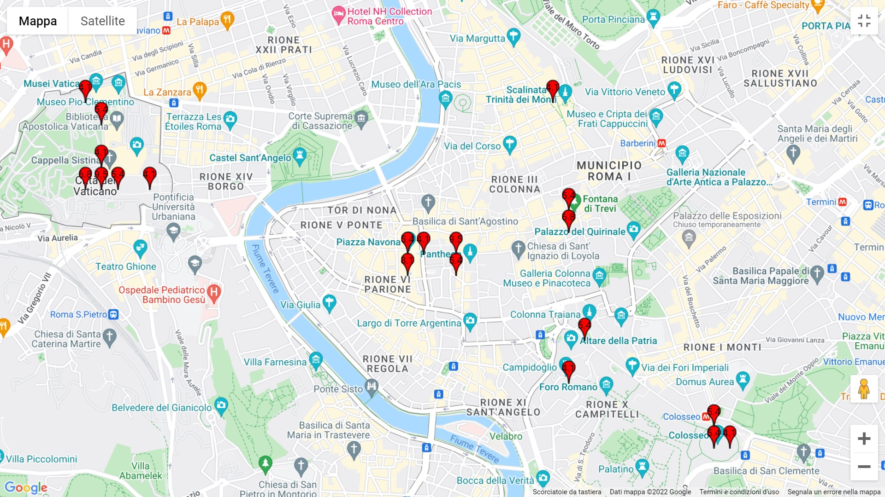
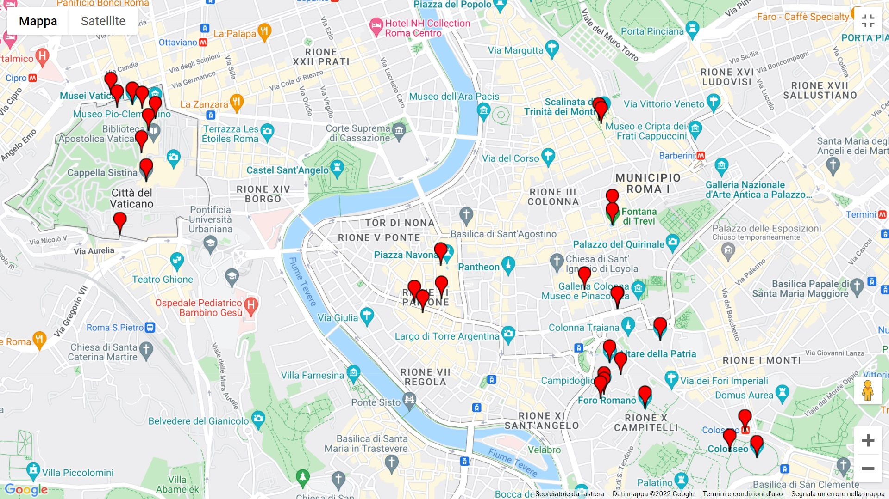
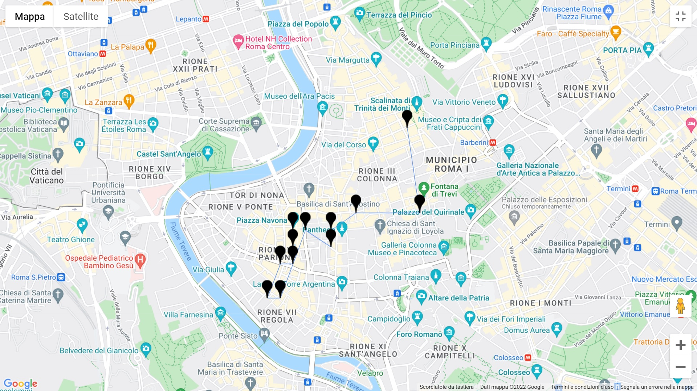

:earth_americas: # POI analysis via Flickr with Python 
___This project aims to provide a simple and fast code that allows you to obtain the major places of interest in a specific geographic area___
___
## Description
__The project was carried out with the help of libraries 
[flicrapi](https://pypi.org/project/flickrapi/) e [googlemaps](https://developers.google.com/maps/documentation/places/web-service/overview).
The project consists of a series of methods that allow the user to obtain information on which were the most visited places in a specific region and in a precise time range.__

__To get this information, available both in Json format
and displayed in Google Maps, it was necessary to make a series of calls to the two aforementioned APIs__
* __The first call is made to the Flicrk API to retrieve the photos taken by users__
* __Through the geographic coordinates (lat, long) obtained from Flickr, Google Maps is queried to obtain the places
  of greatest interest__
  
___

## Requirements

* Flickr API key and Flickr secret
* Google Maps API key

---

##Methods
* __The methods that will be used to obtain the final output are described below__

|__Method__|__Required parameters__|
|---|---|
|_photoProcessing()_|_bbox:String, start_year:int, start_month:int, start_day:int, max_year:int, max_month:int, max_day:int_|
|_mostVisited()_|_photo:[], placesNumber:int|
|_gmapPlot()_|place:[]|
|flickrPlot()|photo:[]|

## Description

* __photoProcessing():__ 
this method returns two Jsons, one containing all the 
  information of the photos uploaded by FLicrk users,
  and a Json containing for each user a set of coordinates
  representing the places visited by the user.
  
__Parameters__  

    1. bbox: is a string representing the 4 coordinates
    of the rectangle that delimits the area of interest.
   
    2. start_year:is an integer representing the year of the start of the search,
    similarly start_month and start_day

    3. max_year: is a string that represents the year of the end of the search
      similarly __max_month__ and __max_day__
   
* __mostVisited():__ This method allows you to query Google Maps for information on places
of interest, such as museums, parks or other tourist attractions.
  It outputs two Jsons, one containing all the data obtained from google's Place API, and a
  Json containing only useful information such as _coordinate_ and _name_

__Parameters__
  
    1. photo[]: is the output of the photoProcessing method, and contains the information of the places grouped by single user

    2. placeNumber: is the integer that specifies the number of places you want to be suggested

* __gmapPlot():__ It is the method that allows you to represent the places of interest obtained by Google on a map

__Parameters__  
        
    1. place[]: It is the first output of the mostVisited method, and represents an array containing the information of the places obtained from google

* __flickrPlot():__ 
It is the method that allows to plot on the map the places obtained from the Flickr coordinates, and also provides information
on the percentage of users who have visited that place. NB the places on Flickr do not always correspond to a place on the google map,
 but most likely you will find a tourist attraction within a few meters
  
__Parameters__  

    1. photo[]: It is the second output of the most Visited method, and represents the places visited by flickr users, with relative coordinates:
                For each place the number of users who have visited it is specified

----
## Example

```
import Processing.FlickrProcessing as fp
import Processing.Statistica as stat
import Processing.Plot as plt

bbox = "12.343140,41.796729,12.625122,42.000419"
photo = fp.photoProcessing(bbox=bbox,start_year=2019, start_month=6,start_day=1,
                           max_year=2019, max_month=6, max_day=30)
                           
coordinate = stat.mostVisisted(photo,20)
gmapPlace = coordinate[0]
flicrkPlace = coordinate[1]

plt.gmapPlot(gmapPlace)
plt.flickrPlot(flicrkPlace)
```

## Plot results 

_The following photo shows the output of the flickrPlot method.
It shows in Google Maps the n most visited places by Flickr users, 
with a label indicating the percentage of users who have visited it._



_The following photo shows the output of the gmapPlot method.
Show in Google Maps the tourist attractions near the places obtained from Flickr_


---

## Places visited by the user

__It's possible to obtain the places visited by a single user and show them on the map.__

|__Method__|__Required parameters__|
|---|---|
|userPlot()|photo[]|

### Example

```
import Processing.Plot as plt
import Processing.FlickrProcessing as fp

photos = fp.photoProcessing(bbox=bbox,start_year=2019, start_month=6,start_day=1,
                           max_year=2019, max_month=6, max_day=7)
plt.userPlot(photos)
```

### Plot




